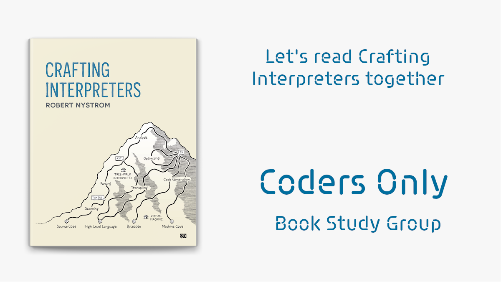
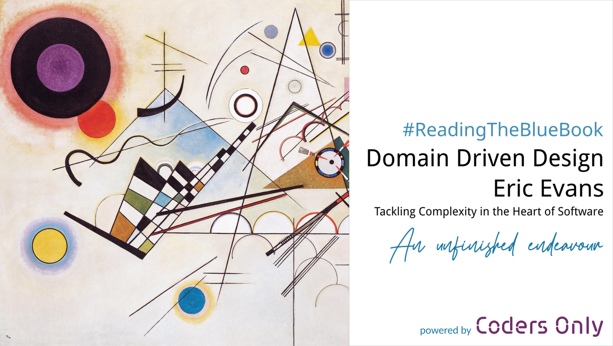
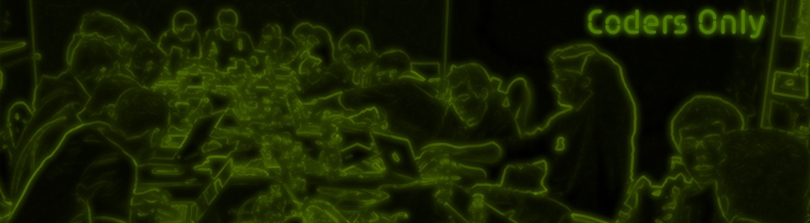

## Crafting Interpreters Study Group

Welcome! - please: sound off, video on

---

## Past Book Studies

mar 2021 - mar 2022

---

## Past Book Studies

feb - oct 2023

---

# Agenda Kick-off

- Who are we (country)
- Our Goal
- the book Crafting Interpreters
- Our Repo
- Our Discord server
- Pace
- Questions & Answers

---

Coders Only is a swiss registered association
We organise events and here we are moderating the studying and providing the infrastructure
Thanks to `Coders Only` for hosting our infrastructure

- videoconferencing on https://whereby.com/

---

# Etiquette

- stay on mute unless you talk
- raise your hand if you want to talk
- keep your video feed on

---

# Zero tolerance for discrimination

- We are trying to create a safe environment for everybody
- We will not tolerate any form of discrimination
    - sexism, homophobia, xenophobia

---

# Safe Environment

## Embrace your ignorance

We are here to learn

---

# The Book

Written very concisely

- read *everything* slowly
    - Foreword, introduction, footnotes
- don't get scared by the hairy mathematical examples, we won't use them

---

## How do we do this?

1. We are in a group

---

## How do we do this?

1. We are in a group
2. We take small bites

---

## How do we do this?

1. We are in a group
2. We take small bites

---

# Pace

The difficulty of the homework will determine the pace

- initial 2-3 weeks: OK?

---

# Our logistics

- Comprehension questions, homework questions: Discord channel
    - https://discord.gg/xw7wAUe2nx
- Sessions: invites through Meetup
- Videoconferencing: single URL:
    - https://codersonly.whereby.com/hello

---

# Questions & Answers
